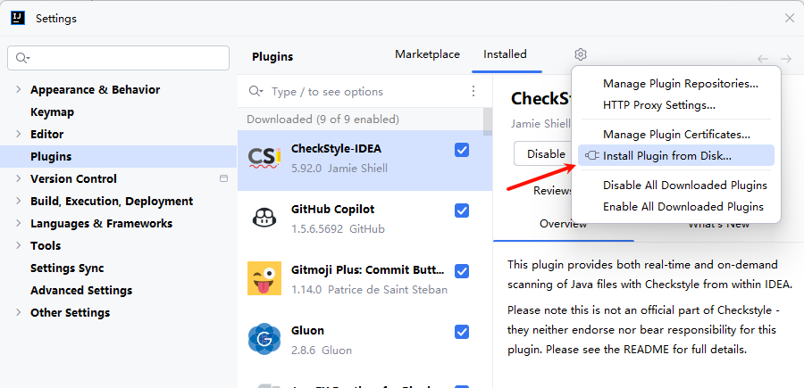
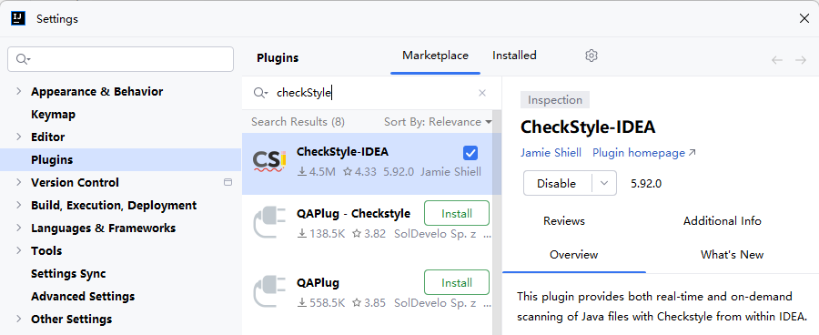
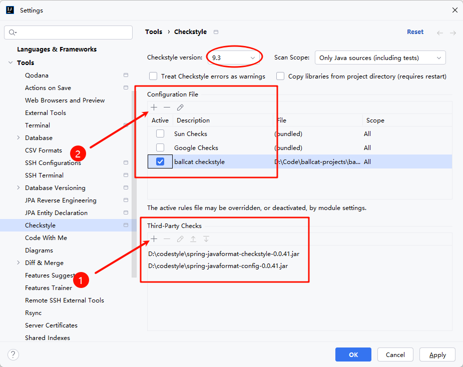

# 代码规范

项目使用 git 本地钩子，在代码提交时会进行代码格式和代码风格校验。  
必须需配置 Maven 的环境变量，否则会导致钩子校验失败，无法正常提交，可以通过在命令行窗口输入 `mvn -v` 确认环境变量配置是否正确。
:::warning 注意
拉取项目后，务必在根路径下先进行一次项目的 clean install 保证 git hooks 的正确安装。
:::

## 代码格式化

项目统一使用 spring-javaformat Maven 插件进行代码格式化，所有代码必须使用该插件进行格式化再进行提交。
可以通过图形化操作或者命令行执行 `mvn spring-javaformat:apply` 进行代码统一格式化。

对于部分特殊代码需要跳过格式化控制的，可以通过在上下文添加指定注释进行控制，示例如下：

```java
// @formatter:off
无需格式化的部分代码
// @formatter:on
```


## 代码风格
代码风格使用 Spring 的 CheckStyle 约束规则，同时通过 checkstyle maven 插件进行校验。
为了方便修改，ballcat 拷贝了一份 spring 的 checkstyle.xml 文件置于 **ballcat-parent** 模块下。


## Idea 配置

代码格式化和代码风格默认都是在代码提交或者项目编译的时候进行检测，这并不友好，我们可以通过安装插件在代码编写过程中提前发现风格问题。


### 格式化插件

Idea 默认的格式化行为不符合 spring-javaformat 的格式化规范，我们可以安装 spring-javaforamt 的插件来进行覆盖 Idea 的默认格式化行为。

由于 spring-javaforamt 插件并没有发布到 Idea 插件市场，所以需要我们手动下载安装。

目前 ballcat 使用的是 0.0.41 版本的 spring-javaforamt，对应版本的插件下载地址：[spring-javaformat-intellij-idea-plugin-0.0.41.jar](https://repo1.maven.org/maven2/io/spring/javaformat/spring-javaformat-intellij-idea-plugin/0.0.41/spring-javaformat-intellij-idea-plugin-0.0.41.jar)

下载完成后，通过以下方式选择下载的插件文件完成安装：



> spring-javaforamt 其他版本的插件下载地址可以在 Maven 仓库中找到：[spring-javaformart-plugin-maven](https://repo1.maven.org/maven2/io/spring/javaformat/spring-javaformat-intellij-idea-plugin/)


### CheckStyle 插件

**插件安装**  

在插件市场中，搜索 CheckStyle 插件并进行安装。



**插件配置**

spring-javaformat 配合 checkstyle 需要额外下载两个依赖包：
- [spring-javaformat-config-0.0.41.jar](https://repo1.maven.org/maven2/io/spring/javaformat/spring-javaformat-config/0.0.41/spring-javaformat-config-0.0.41.jar)
- [spring-javaformat-checkstyle-0.0.41.jar](https://repo1.maven.org/maven2/io/spring/javaformat/spring-javaformat-checkstyle/0.0.41/spring-javaformat-checkstyle-0.0.41.jar)

下载完成后，打开 Idea 的 Settings, 找到 Tools -> Checkstyle，按下图所示进行配置：



1. 在 Third-Party Checks 一栏中添加刚才下载的依赖包：
   - spring-javaformat-checkstyle-0.0.41.jar
   - spring-javaformat-config-0.0.41.jar

2. 在 Configuration File 中添加 ballcat 的 checkStyle 配置文件  

   文件位于项目 **ballcat-parent** 模块下： **/src/checkstyle/checkstyle.xml**

3. CheckStyle 的版本设置为 9.3

### Idea 导包设置

风格规则中控制了导包顺序，需要设置下 idea 默认的导包顺序, 依次打开 Editor -> Code Style -> Java -> Imports，按如下规则进行设置：
```java
import java.*
<blank line>
import javax.*
<blank line>
import all other imports
<blank line>
import static all other imports
```


另外不允许使用 * 进行全量导入，所以以下两个设置的值需要设置的高一点：
- Class count to use import with '*'
- Names count to use static import with '*'

